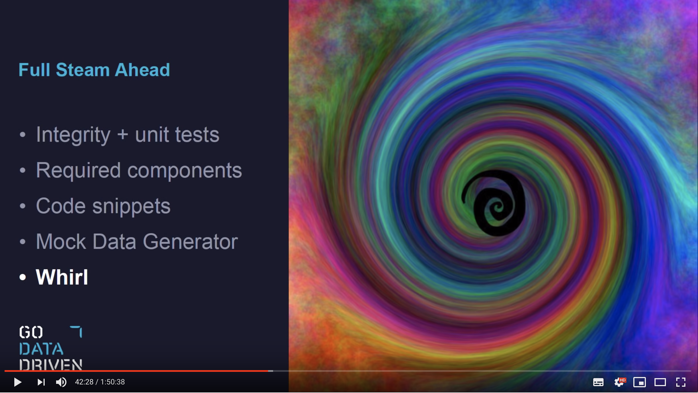

# whirl


_Fast iterative local development and testing of Apache Airflow workflows_

The idea of _whirl_ is pretty simple: use docker containers to start up Apache Airflow and the components used in your workflow. This gives you a copy of your production environment that is running on your local machine. This allows you to run your DAG locally from start to finish - with the same code as it would on production. Being able to see your pipeline succeed gives you more confidence about the logic you are creating/refactoring and the integration between the different components you are facing. An additional benefit is that it gives (new) developers an isolated environment to experiment with your workflows.

_whirl_ connects the code of your DAG and your (mock) data to the Apache Airflow container that it spins up. By using volume mounts, you are able to make changes to your code in your favorite IDE and immediately see the effect in the running Apache Airflow UI on your machine. This even works with custom Python modules that you are developing (and using) in your DAGs.

NOTE: _whirl_ should not be a replacement for properly (unit)testing the logic you are orchestrating with Apache Airflow.


## Prerequisites

_whirl_ under the hood heavenly relies on [Docker](https://www.docker.com/) and [Docker Compose](https://docs.docker.com/compose/). Make sure you have it installed and that you have given enough RAM (8GB or more recommended) to Docker to let it run all your containers.

The current implementation was developed on Mac OSX, but should in theory work with any operating system supported by Docker.

## Getting Started

Clone this repository

```
git clone https://github.com/godatadriven/whirl.git <target directory of whirl>
```
For ease of use you can add the basedirectory  to your `PATH` environment variable

```
export PATH=<target directory of whirl>:${PATH}
```

## Usage

All starts with executing the _whirl_ script.

### Getting usage information
```
$ whirl -h
$ whirl --help
```

### Starting whirl

The default action of the script is to start the `default` environment with the dag from your current directory.

Specifying the `start` commandline argument makes whirl start the docker containers in daemonized mode.

```
$ whirl [start]
```
If you want a more specialized environment you can add the `-e` or `--environment` commandline argument with the name of the environment. This name corresponds with a directory in the `envs` directory.

```
$ whirl [start] -e <envronment>
```

### Stopping whirl

```
$ whirl stop
```
Stops the `default` environment

If you want to stop all containers from a more specialized environment you can add the `-e` or `--environment` commandline argument with the name of the environment. This name corresponds with a directory in the `envs` directory.

```
$ whirl stop -e <environment>
```

### Use of environment variables

Inside the whirl script the following environment variables are set:

| var | value | description |
| ----- | ----- | ----- |
| DOCKER\_CONTEXT\_FOLDER | ${SCRIPT_DIR}/docker | Base build context folder for docker builds referenced in docker compose |
| ENVIRONMENT\_FOLDER | ${SCRIPT_DIR}/envs/\<environment\> | Base folder for environment to start. Contains docker-compose.yml and environment specific preparation scripts |
| DAG\_FOLDER | $(pwd) | Current working directory. Used as Airflow DAG folder. Can contain preparations scripts to prepare for this specific DAG. |
| PROJECTNAME | $(basename ${DAG_FOLDER}) | |

## Structure

- envs. = docker-compose + preparations
- whirl: combines DAG files with environment
- dag preparations


## Examples

### default (localhost ssh)

### api-to-s3

### sftp-mysql

## References

An early version of _whirl_ was brought to live at [ING](https://github.com/ing-bank). Bas Beelen gave a presentation about how _whirl_ was helpful in their infrastructure during the 2nd Apache Airflow Meetup, January 23 2019, hosted at Google London HQ.

[](https://www.youtube.com/watch?v=jqK_HCOJ9Ak)
